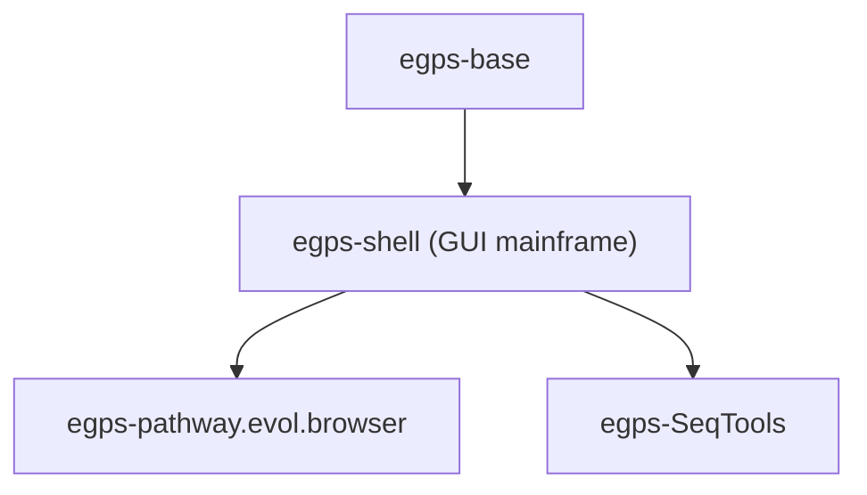
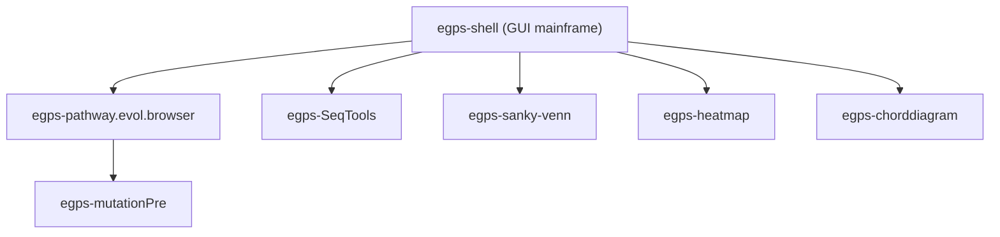

# eGPS v2 (eGPS2) — Final Release Collection

This folder is the **final release workspace** for the eGPS2 software platform.

If you are an end user and not familiar with the terminal, you do **not** need to learn the internal modules or use the command line: just download the packaged release, unzip it, and double-click the launcher.

Go to [Releases](https://github.com/yudalang3/eGPS_v2/releases) to download.

[中文版 README](README_zh.md)

## What is eGPS2?

**eGPS (The evolutionary Genotype Phenotype System Biology)** is a modular bioinformatics software platform.

This repository area collects the core framework and a set of applications/tools, so we can publish a **single, end-user-friendly** final software package.

## For end users (recommended)

- Download the latest packaged release from the project release page.
- Unzip it to any folder.
- Launch eGPS2 using the provided launcher (double-click).

Notes:
- Some releases bundle a Java runtime. If you choose the **no-JRE** variant, install a Java runtime that meets the requirements of that release.

## What is included here?

Main stream modules (typical dependency order):

- `egps-base`: base utilities and infrastructure (open source)
- `egps-shell`: the GUI shell framework hosting desktop modules, including the mainframe source code (open source)
- `egps-pathway.evol.browser`: application module (Pathway Evolution Browser)
- `egps-SeqTools` (SeqTools): biological sequence analysis tools and workflow modules

Their dependencies are shown below. In both diagrams, arrows point from a base module to an upper-level module that depends on it:

Other standalone application modules in this collection (examples):

- `egps-mutationPre`: genomic mutation presenter (depends on egps-pathway.evol.browser)
- `egps-sanky-venn`: Sankey plot and Venn plot (merged module)
- `egps-heatmap`: heatmap plot
- `egps-chorddiagram`: chord diagram

Most of these modules are at the same level as `egps-pathway.evol.browser` / `egps-SeqTools`, except `egps-mutationPre` which depends on `egps-pathway.evol.browser`.

Of course, you can also develop your own projects on top of the upper-level modules (e.g. `egps-pathway.evol.browser`) because the eGPS2 functional modules are open sourced.

## For developers (optional)

The project source code is open source and available in the corresponding GitHub repositories. See the documentation links below.

You can import the projects into IntelliJ IDEA, Eclipse, or VS Code. We use IntelliJ IDEA by default. The `egps-shell` JAR is already included in the no-install release package; please add compile-time dependencies as needed for development.

## Documentation

Usage instructions and development tutorials are available on GitHub:

- [eGPS platform reference documentation](https://github.com/yudalang3/egps-shell/blob/main/docs/README_TableOfContents.md)
- [Module and plugin development tutorials](https://github.com/yudalang3/egps-shell/blob/main/manuals/module_plugin_course/README.md)
- [Pathway Evolution Browser usage guide](https://github.com/yudalang3/egps-pathway.evol.browser/blob/main/README.md)
- [egps-SeqTools (SeqTools) module guide](https://github.com/yudalang3/egps-SeqTools/blob/main/README.md)

Usage tutorials and development documentation are also available on Yuque:

- [eGPS v2 Chinese User Manual (Yuque)](https://www.yuque.com/yudalang3/egpsdoc)
- [Pathway Evolution Browser Chinese User Manual (Yuque)](https://www.yuque.com/yudalang3/pathway.browser)
- [eGPS v2 English User Manual (Yuque)](https://www.yuque.com/yudalang3/egps2-english)

## License

See `LICENSE` in this directory and the license files inside each module.
