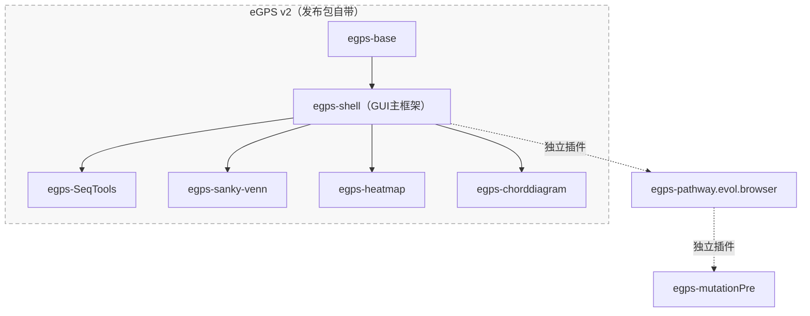

# eGPS v2（eGPS2）— 最终发布集合

本目录用于 **eGPS2 平台的最终发布**（Release Collection）。

如果你是不熟悉命令行的普通用户，你不需要了解内部模块结构，也不需要使用命令行：只要下载打包好的发布版本，解压后双击启动即可。

请前往 [Releases 页面](https://github.com/yudalang3/eGPS_v2/releases)下载发布版本。

[English README](README.md)

## eGPS2 是什么？

**eGPS（The evolutionary Genotype Phenotype System Biology）** 是一个模块化的生物信息学软件平台。

本仓库/目录将 eGPS2 的核心框架与多个应用/工具模块进行汇总，用于发布一个对非技术用户更友好的 **最终可用软件包**。

## 给不熟悉命令行的用户（推荐）

- 从项目的 Release 页面下载最新的打包版本。
- 解压到任意目录。
- 双击发布包内的启动程序启动 eGPS2。

说明：
- 部分发布包自带 Java 运行环境。如果选择不含 Java 运行环境的 no-JRE 版本，需要自行安装符合该发布版本要求的 Java 运行环境。

## 这里包含哪些内容？

**eGPS v2 的本质核心是 `egps-base` 与 `egps-shell`**：`egps-base` 提供基础工具与核心基础设施（开源）；`egps-shell` 是承载桌面模块的 GUI 壳框架，包含主框架源代码（开源）。发布包在核心之外还**自带**以下功能模块：

- `egps-SeqTools`（SeqTools）：生物序列分析工具与工作流模块集合
- `egps-sanky-venn`：桑基图与 Venn 图（合并模块）
- `egps-heatmap`：热图
- `egps-chorddiagram`：弦图

它们的依赖关系如下（**虚线框内即 eGPS v2 发布包自带的内容**；实线箭头由基础模块指向依赖它的上层模块）：

此外还有两个**独立插件**——它们**不属于** eGPS v2 发布包，可作为可选扩展另行安装（图中位于虚线框外，以虚线箭头表示）：

- `egps-pathway.evol.browser`：应用模块（Pathway Evolution Browser），其他应用模块的模板
- `egps-mutationPre`：基因组突变展示（依赖于 egps-pathway.evol.browser）

当然您也可以在 `egps-pathway.evol.browser` 这些上层的模块基础上进行项目开发，因为eGPS2的所有功能模块都是开源的。

## 给开发者（可选）

各项目源码均开放，可在相应的 GitHub 仓库中查看，相关入口见下方文档链接。

你可以将项目导入 IntelliJ IDEA、Eclipse 或 VS Code；我们默认使用 IntelliJ IDEA 开发。免安装发布包中已提供 `egps-shell` 对应的 JAR 文件，开发时请按项目说明添加编译依赖。

## 文档

使用说明和开发教程可在以下 GitHub 文档中查看：

- [eGPS 平台参考文档目录](https://github.com/yudalang3/egps-shell/blob/main/docs/README_TableOfContents_zh.md)
- [模块与插件开发教程](https://github.com/yudalang3/egps-shell/blob/main/manuals/module_plugin_course/README_zh.md)
- [Pathway Evolution Browser 使用说明](https://github.com/yudalang3/egps-pathway.evol.browser/blob/main/README_zh.md)
- [egps-SeqTools（SeqTools）模块说明](https://github.com/yudalang3/egps-SeqTools/blob/main/README_zh.md)

也可以在语雀查看使用教程和开发文档：

- [eGPS v2 中文使用手册（语雀）](https://www.yuque.com/yudalang3/egpsdoc)
- [eGPS-pathway.evol.browser 中文使用手册（语雀）](https://www.yuque.com/yudalang3/pathway.browser)
- [eGPS v2 英文使用手册（语雀）](https://www.yuque.com/yudalang3/egps2-english)

## 许可证

请查看本目录的 `LICENSE`，以及各模块目录中的许可说明。
